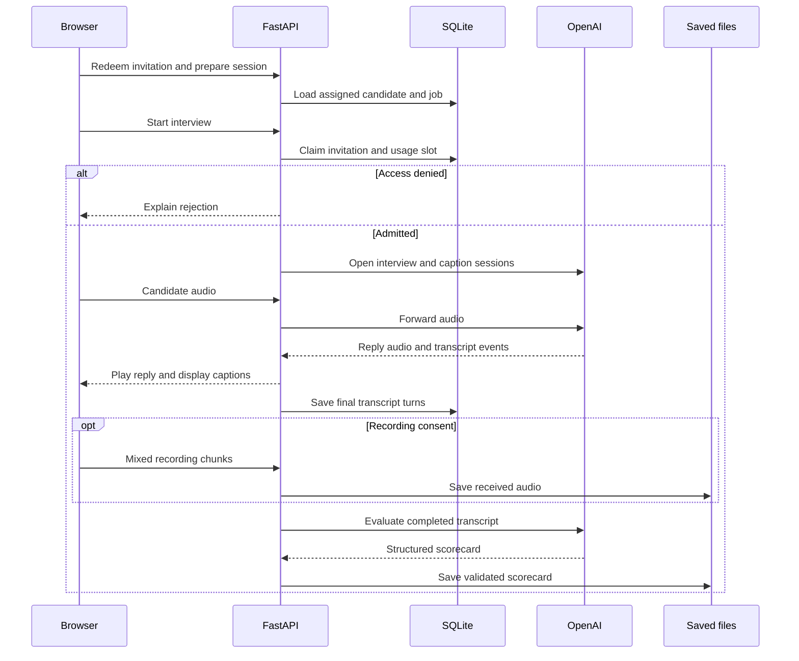

# Understanding, committing and hosting TalentSift

Prepared for Damitan on 28 September 2026, from the TalentSift source we have
been updating. This describes the current implementation. Your Windows Git
history and any additional edits on your laptop were not available for review.
No GitHub push or deployment was performed while preparing this guide.

## 1. Separate code, configuration and data

These three things have different jobs and different lifecycles.

| Part | Examples in TalentSift | Where it belongs |
| --- | --- | --- |
| Source code | Python, HTML, CSS, JavaScript, prompts, tests, dependency pins | Git repository and GitHub |
| Configuration | API key, public URL, data directory, usage limits, optional account bootstrap settings | Local `.env`; hosting environment settings in production |
| Runtime data | Recruiter account, jobs, candidate names, sessions, invitations, transcripts, recordings and scorecards | Local data directory during development; persistent storage in production |

An environment is a running copy of the program together with its own settings
and data. Your laptop is the development environment. The hosted service is
the production environment. They can run identical code and still have different
recruiter accounts, jobs and interview results.

Editing a Python file changes the program's instructions. Creating a recruiter
changes a database row. Git records selected files; it does not automatically
synchronize the databases of running applications.

`config.py` reads `TALENTSIFT_DATA_DIR`, defaulting to `data`. The current stores are:

| Location under that directory | Contents |
| --- | --- |
| `talentsift.db` | Jobs, candidates, sessions, transcript turns, recruiter credentials, login sessions, invitations, usage counters and rate-limit records |
| `scorecards/` | Evaluation results, recruiter overrides and their audit history |
| `recordings/` | Consented audio recordings and their metadata |
| `fairness_tests.json` | Saved controlled fairness experiments |

The directory must persist as a whole. Preserving only SQLite would leave audio
and scorecards vulnerable to loss. Runtime data also needs a private backup:
persistence means surviving a restart, while backup means recovering from
deletion, corruption or an application mistake.

## 2. What happens to your recruiter account when you host?

`python manage_access.py create-recruiter` saved your username and salted scrypt
password hash in the database configured on the machine where you ran it.
The password itself is not stored as plaintext.

Your current local account remains on your laptop when you deploy. A fresh host
starts with a new database unless you transfer data or attach an existing one.
Uploading the Python source alone does not upload the account.

For the first beta deployment, I recommend an empty production database and a
production recruiter account. You can choose the same username and password,
although using a distinct production password keeps development separate.
Your old test candidates do not have to become production candidates.

The current code supports two setup methods:

1. In the running service's administrative shell, run
   `python manage_access.py create-recruiter`. This must use the production
   environment and persistent data path.
2. Alternatively, generate a hash locally with
   `python manage_access.py password-hash`. Put `TALENTSIFT_RECRUITER_USERNAME`
   and the resulting `TALENTSIFT_RECRUITER_PASSWORD_HASH` into the host's secret
   environment settings. Paste the full hash, including all `$` separators.
   The application creates/configures the account at startup.

The second method fits the existing app without a database transfer. The hash
is sensitive configuration: keep it out of GitHub. Those bootstrap settings
remain authoritative while configured. Changing either value can replace the
account and revoke its logins; unchanged values leave the existing account alone.
Do not regenerate the hash on every deployment.

If existing local results must be preserved, that is a separate data migration:
make a consistent private backup with writes paused and transfer the full data
directory through a secure channel to the persistent mount. Never use a Git
commit to transfer it. Avoid copying a live SQLite database file casually.

Once production uses persistent storage, normal code redeployments keep the
production account and data. Deleting the volume or pointing the application at
a different data directory changes that outcome. You will sign in on the new
hostname; local browser login cookies do not become production cookies.
Create and share candidate links from the hosted dashboard so their URLs point
to the hosted site.

## 3. What your product actually does

TalentSift is an AI-assisted voice interview and recruiter review application.
The current application serves both the candidate interface and recruiter pages
from one FastAPI backend. Uvicorn runs that backend and handles its HTTP and
WebSocket connections. A WebSocket keeps a connection open so audio and events
can travel in both directions throughout an interview.



OpenAI supplies model inference. Your application supplies access control,
session state, turn scheduling, consent, storage, review tools and usage limits.
Those responsibilities explain why a product is more than an API call.

### Follow one interview

1. **The recruiter signs in.** The server checks the form's origin and CSRF
   token, verifies the password hash, and issues a random session cookie.
   Protected pages check the session server-side. Hiding a button would not
   protect its underlying API or audio download.
2. **The recruiter creates an invitation.** The server associates an expiring
   random secret with a candidate name and job. It stores the secret's hash.
   The full invitation is shown once so the recruiter can copy it.
3. **The candidate opens the link.** The browser exchanges the secret in the
   URL fragment for a candidate cookie. The server supplies the name and job;
   changing browser form fields cannot assign a different identity.
4. **The candidate prepares.** They choose a language, give interview consent,
   optionally consent to saving audio, and select/test their microphone.
   Preparing the session does not consume the invitation.
5. **The server admits the interview.** Before opening the paid interview
   connection, an SQLite transaction checks the invitation, session, daily
   allowance and available concurrent capacity. It consumes the invitation and
   records the admitted start together. This prevents two simultaneous requests
   from using one invitation twice.
6. **Bianca conducts the interview.** Browser microphone audio goes to FastAPI,
   then to OpenAI. Bianca's audio returns through FastAPI for browser playback.
   Behavior instructions come from `prompts/interviewer_prompt.txt`; the six core
   questions and coverage checks come from `interview_coverage.py`.
7. **Captions and records are produced.** A separate live-caption connection
   provides provisional words. The primary interview produces final transcript
   turns, which the backend stores in order. Provisional captions are not the
   evidence used for scoring.
8. **Consented audio is saved separately.** The browser mixes microphone audio
   with Bianca's playback and uploads recording chunks on a separate WebSocket.
   Received partial recordings can remain available as incomplete recordings.
9. **The completed interview is evaluated.** The app waits for final transcripts.
   Missing/failed transcription can prevent scoring. A separate evaluator uses
   the rubric and transcript; the recruiter reviews its scorecard and evidence.
   Recruiter overrides preserve the original AI result and record an actor,
   reason and history.

The invitation establishes possession of a link, not verified human identity.
Someone could forward an unused invitation. Its prefilled name is an assigned
identity, not proof that the speaker is that person.

### Audio, captions and timing are different mechanisms

The browser requests echo cancellation, noise suppression and automatic gain
control. The interview connection also requests a configurable near-field or
far-field noise-reduction profile. The actual capture quality still depends on
the microphone, browser, room and network. Noise processing does not guarantee
correct names or word recognition.

The primary interview uses semantic voice activity detection by default.
`interview_turns.py` schedules replies after committed speech without waiting
for the final text transcription. That separation reduces transcript-related
reply delay. It also handles resumed speech and canceled responses.

`live_captions.py` opens an additional transcription session with turn detection
disabled. It offers provisional deltas without controlling Bianca or writing
the official interview transcript. If captions fall behind, the optional stream
can stop while final transcription remains available. This extra inference can
add cost; `TALENTSIFT_LIVE_CAPTIONS=0` disables the optional stream.

Current model identifiers in this source copy are `gpt-realtime` for the voice
interview, `gpt-transcribe` for its final input transcription,
`gpt-live-transcribe` for provisional captions, and `gpt-5.6-terra` for scoring.
These are configuration/code facts, not a guarantee of access for every API
project. The deployment smoke test must exercise your own configured project.

### Scoring has its own data pipeline

`scoring/session_scoring.py` builds three representations: the original full
transcript, a scoring copy with limited identity redaction and filler cleanup,
and original candidate-only speech for evidence verification. The original
transcript is retained. Name redaction is a limited pattern-based safeguard,
not complete anonymization.

The current rubric weights are Relevant Experience 30%, Problem Solving 25%,
Communication 20%, Role Motivation 15%, and Culture & Values Fit 10%.
The evaluator returns a validated scorecard; application checks include evidence
verification. A correctly shaped response does not by itself prove that an AI
judgment is correct or fair. The recruiter still needs to inspect evidence.
Controlled fairness experiments are diagnostic checks, not certification.

## 4. Where to look when you change something

| Question or change | Main files | Responsibility |
| --- | --- | --- |
| Microphone, transcript display, candidate flow | `client/index.html`, `client/styles.css` | Browser behavior and appearance |
| Browser audio recording | `client/audio-recorder.js` | Mix, encode and upload recording chunks |
| HTTP routes and main interview connection | `app.py` | Coordinate session lifecycle, OpenAI and browser events |
| Core questions and coverage checks | `interview_coverage.py` | Six bilingual core questions across five scoring areas; normal-finish guard |
| Interview behavior | `prompts/interviewer_prompt.txt` | Tone, follow-ups and use of the server question plan |
| Who can sign in or start an interview | `access_control.py`, `access_routes.py` | Account/session storage, invitations, admission, route checks |
| Set up or reset the recruiter | `manage_access.py` | Administrative command-line operations |
| Pauses, interruptions and response scheduling | `interview_turns.py` | Turn state and ordered final transcripts |
| Words displayed during speech | `live_captions.py` | Optional provisional transcription stream |
| Paired-task cancellation and failure classification | `relay_lifecycle.py` | Cleanup after connection failures |
| Recording transport, metadata and downloads | `recording_routes.py`, `recording_storage.py` | Save and serve authorized recordings |
| Database and runtime paths | `database.py`, `models.py`, `config.py` | SQLite persistence, validated data structures, configured directory |
| Evaluation rules and result validation | `scoring/rubric.py`, `scoring/engine.py`, `scoring/models.py` | Rubric, evaluator request and scorecard checks |
| Prepare transcripts and save/override scores | `scoring/session_scoring.py`, `scoring/privacy.py`, `scoring/text_normalization.py` | Evaluation input and persisted results |
| Recruiter review and fairness summaries | `recruiter_dashboard.py`, `templates/`, `fairness_storage.py` | Review pages and aggregate displays |
| Expected behavior and regressions | `tests/` | Automated checks of audio, access, lifecycle and scoring behavior |

Some older comments refer to earlier implementation stages. Follow the actual
call paths when a comment and current code disagree. `storage.py` also retains
an older JSON session repository; the current browser interview stores its
session and transcript through SQLite.

Important current boundaries:

- There is one recruiter account, without isolation between multiple companies.
- Job titles can be edited, but the interview prompt and shared scoring rubric
  are fixed to Junior Python Backend Developer. `build_instructions` substitutes
  the language, not a job-specific rubric. A different job label does not create
  a different interview design. Keep that role explicit in the beta.
- An interrupted interview cannot automatically resume its original OpenAI
  conversation. Saved data can survive while the live conversation ends.
- Default limits are 10 admitted starts per UTC day, 2 concurrent interviews,
  and a 600-second interview window. Failed admitted starts still count.
  These bound usage; they are not an exact dollar spending ceiling.
- SQLite and local JSON/audio storage suit a small single-instance deployment.
  More independent server instances require a shared data/admission design.

## 5. What to commit to GitHub now

A commit records the contents selected in Git's staging area. A push sends those
commits to a remote repository. Hosting is a further step that runs a selected
commit with production settings and production data.

Your accumulated implementation work includes audio saving, recorder loading
fixes, live captions, turn scheduling and disconnect cleanup, recruiter login,
candidate invitations, usage limits and the login origin-policy correction.
Use your actual diff to determine which of those changes are still uncommitted.

Include Python modules, `client/`, `templates/`, `prompts/`, `scoring/`, `tests/`,
`docs/`, `requirements.txt`, `README.md`, `WORK_LOG.md` and `.gitignore`.
Include genuine source assets such as the CSS and images the app uses.
Keep these out: `.env` and its secret variants, the entire runtime `data/`
directory, database backups, real interview audio/transcripts, virtual
environments, caches, and downloaded update ZIPs. A private repository still
needs this separation.

The current `.gitignore` already excludes `.env`, `.env.*`, `data/`, virtual
environments and Python/pytest caches; it permits a future safe `.env.example`.
Ignoring a file does not stop tracking it if it was already committed.

Run these inspection commands in your Windows project terminal:

```powershell
git status --short
git diff --stat
git ls-files -ci --exclude-standard
```

The last command lists tracked files that now match ignore rules. Inspect any
output before continuing. If `.env` or `data/` is tracked, this removes those
paths from Git's index while keeping your local files:

```powershell
git rm -r --cached --ignore-unmatch -- .env data
```

Untrack any other secret environment files individually if listed. Untracking
does not erase an earlier commit. If an API key was committed, revoke/rotate it
and address the affected history before pushing; do not bypass secret detection.

Stage the intended source directories and review the exact snapshot:

```powershell
git add -- .gitignore README.md WORK_LOG.md requirements.txt "*.py" client templates prompts scoring tests docs
git diff --cached --name-only
git diff --cached --stat
git diff --cached
git grep --cached -l -I -E 'sk-[A-Za-z0-9_-]{20,}|ghp_[A-Za-z0-9]{20,}|BEGIN.*PRIVATE KEY'
```

The grep prints matching filenames, not secret values. No matches normally
means exit status 1. It is a limited scan, not proof that the snapshot contains
no secrets. Inspect staged changes and filenames as well; remove any unintended
files from staging before committing. There is no need to paste secret values
into a chat for review.

For an existing GitHub-connected repository, after that review:

```powershell
git commit -m "Add recruiter access, candidate invitations, audio recording, and interview reliability fixes"
git push
```

If the branch has no upstream, inspect `git branch --show-current` and
`git remote -v`, then use `git push -u origin YOUR_BRANCH_NAME`, replacing the
placeholder with the actual branch. Do not assume the branch is called `main`.
If this is not a Git repository at all, initialize/connect the repository first;
the commands above assume your existing repository is already present.

The source copy reviewed here contained no matches for the checked API-key,
GitHub-token and private-key patterns outside excluded runtime/configuration
paths. That check does not examine your laptop's files or Git history. The
current coverage update passed 98 Python tests and 19 JavaScript tests here. No real browser login or hosted interview has been verified here.

Keep the existing pinned `requirements.txt` for this release. Running
`pip freeze` from an unrelated/global environment could replace it with packages
the application does not need. Update dependencies deliberately from the app's
own environment and verify the resulting change.

## 6. A concrete hosting path for this version

Recommendation: one Render **Web Service** with a paid compute instance and an
attached persistent disk. GitHub Pages cannot run this FastAPI/WebSocket
backend. A Render static site is also the wrong service type for this app.

Render's free web services do not support persistent disks and lose local
filesystem changes on redeploy/restart/spin-down. That includes this app's
database, recordings and usage counters. Free hosting with external database
and object storage is another architecture, requiring code changes; this app
does not switch to those stores merely by adding a database URL.

Use the hosting dashboard to configure:

| Setting | Value for TalentSift |
| --- | --- |
| Repository | Your GitHub repository, connected through the GitHub integration |
| Branch | The branch you intend to release |
| Runtime | Python |
| Root directory | The repository directory containing `app.py` and `requirements.txt` |
| Python version | Pin the tested local version using `PYTHON_VERSION`; inspect it with `python --version` |
| Build command | `pip install -r requirements.txt` |
| Start command | `uvicorn app:app --host 0.0.0.0 --port $PORT` |
| Health-check path | `/health` |
| Service instances | One |
| Persistent disk mount | `/var/data` |
| Auto-deploy | Off initially; deploy intentionally between interview sessions |

`app:app` means the `app` object in the `app.py` module. `0.0.0.0` makes the
server listen on the hosting instance's network interfaces. `$PORT` is expanded
by the hosting environment. Put that command in Render's start-command field;
the variable syntax is not a PowerShell instruction. Development's `--reload`
is omitted in production.

Set production environment variables in the host dashboard:

| Variable | Value |
| --- | --- |
| `OPENAI_API_KEY` | Your actual server-side API key |
| `TALENTSIFT_DATA_DIR` | `/var/data/talentsift` |
| `TALENTSIFT_PUBLIC_URL` | The exact assigned HTTPS origin, e.g. `https://YOUR-SERVICE.onrender.com` |
| `TALENTSIFT_RECRUITER_USERNAME` | Your chosen production recruiter username, if using bootstrap |
| `TALENTSIFT_RECRUITER_PASSWORD_HASH` | The exact generated hash, if using bootstrap |
| `TALENTSIFT_DAILY_INTERVIEWS` | `10` initially, or a deliberately chosen allowance |
| `TALENTSIFT_CONCURRENT_INTERVIEWS` | `2` initially |
| `TALENTSIFT_INTERVIEW_SECONDS` | `600` initially |

The URL above is a placeholder: replace it with the assigned address, with no
`/login` path or query. If the service address becomes known only after creation,
set the exact value and redeploy before trying the public login. Leaving
`TALENTSIFT_PUBLIC_URL` unset permits only local loopback access. Set it only in
production; keep your local development configuration separate.

The disk mount and environment path must agree: `/var/data/talentsift` lies under
the `/var/data` mount. The application then stores its database and files there.
The service's disk is available at runtime, not during its build or pre-deploy
command, so account bootstrap belongs in app startup or the running-service shell.

The existing browser code derives its WebSocket address from the page's host and
uses `wss` on HTTPS pages. Serve the candidate page from the same hosted app.
Do not put the OpenAI key into browser JavaScript. With the production origin
configured, access cookies use Secure and HttpOnly settings.

After deploying, check `/login`, sign in, create a job and a personal invitation,
then run one full interview on the actual hosted HTTPS URL. Check candidate
audio, live/final transcript behavior, completion, scoring, saved recording and
sign-out. A passing `/health` only proves the application responds; it does not
prove API billing, model access, microphone capture or the full workflow works.
That real test uses API credits.

Record the verified URL in README and the work log only after this has actually
been done. Hosting fees, OpenAI inference and storage/bandwidth are separate
costs. Keep application limits and provider billing controls configured together.

## 7. How updates work after hosting

Continue developing on your laptop. Test with local development data, review
the diff, commit, push, and deploy the intended commit. Production records stay
on the production disk; new code does not need a fresh empty database each time.
Do not upload your development database with a routine code update.

Render can redeploy automatically when its connected branch changes. For this
live-interview beta, begin with automatic deployment disabled and choose
**Manual Deploy > Deploy latest commit** during a quiet window. This lets you
push a backup of your work without immediately restarting a candidate's session.

An attached Render disk prevents zero-downtime deployments: the old instance
stops before the replacement starts. WebSocket connections also close when their
instance is replaced. TalentSift currently cannot reconstruct and resume an
interrupted interview. Persistent records surviving and a live conversation
surviving are separate properties. Schedule releases outside interview times.

Later, a release branch and automated checks can make deployment more convenient.
Branches only separate code; a staging service also needs separate data and
configuration. Do not point a development/staging instance at production data.

Changing a database structure is a migration, separate from deploying new
Python. The current app creates missing tables and includes specific additive
schema handling at startup, but future schema changes need an explicit migration
and backup plan. Rolling back code does not automatically roll back stored data.

## 8. A practical way to learn the code you own

Trace one candidate through the program rather than memorizing every file:

1. Start at `create_invitation` in `access_routes.py`. Identify what goes into
   SQLite and why the plaintext invitation secret is displayed only once.
2. Follow the candidate's invitation exchange and `/api/session`. Identify where
   the name comes from and why the browser cannot choose a different one.
3. Follow `claim_interview` and the `/ws/interview/...` route. Explain why quota
   admission happens before opening the paid connection and why it is atomic.
4. Trace one microphone chunk and one returned audio chunk. Separate the primary
   interview, provisional captions and optional recording.
5. Follow final transcript storage into `score_database_session`. Identify what
   the evaluator sees, which words count as evidence, and how an override is saved.
6. For each step, ask what happens if the browser refreshes, the server restarts,
   or a request is submitted twice. Locate the rule or test that answers it.

Being able to explain the state changes, trust boundaries and failure behavior
is more valuable than recalling the exact syntax of every function.

## Hosting and Git references

Provider details were checked on 28 September 2026.

- [Render FastAPI deployment](https://render.com/docs/deploy-fastapi)
- [Render persistent disks](https://render.com/docs/disks)
- [Render free-service limitations](https://render.com/docs/free)
- [Render environment variables](https://render.com/docs/configure-environment-variables)
- [Render Python version selection](https://render.com/docs/python-version)
- [Render deploy behavior and manual deploys](https://render.com/docs/deploys)
- [Render WebSocket connection lifecycle](https://render.com/docs/websocket)
- [GitHub ignore rules and already-tracked files](https://docs.github.com/en/get-started/git-basics/ignoring-files)
- [Git staging](https://git-scm.com/docs/git-add) and [reviewing staged changes](https://git-scm.com/docs/git-diff)
- [GitHub pushing commits](https://docs.github.com/en/get-started/using-git/pushing-commits-to-a-remote-repository)

## September 28 update: required topic coverage

The interview now uses six server-supplied core questions across its existing five
scoring areas. Collaboration and feedback/ownership are separate opportunities.
Bianca requests the next question through a tool; normal completion is checked
against generated questions and subsequent candidate audio turns. The hard time
limit and candidate-controlled ending can still stop before every topic.

This is a question-opportunity check, not a measure of answer quality. Coverage
is logged for the active interview; it is not a new recruiter-dashboard field.
See [the coverage guide](interview_coverage.md) for the exact behavior, files,
installation and live-test checklist.
